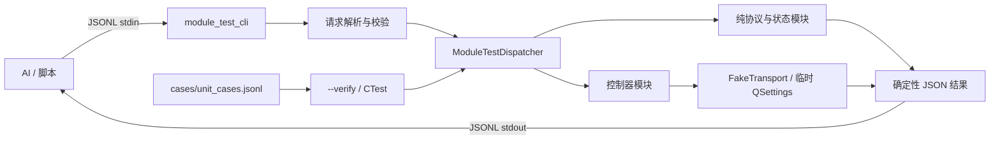
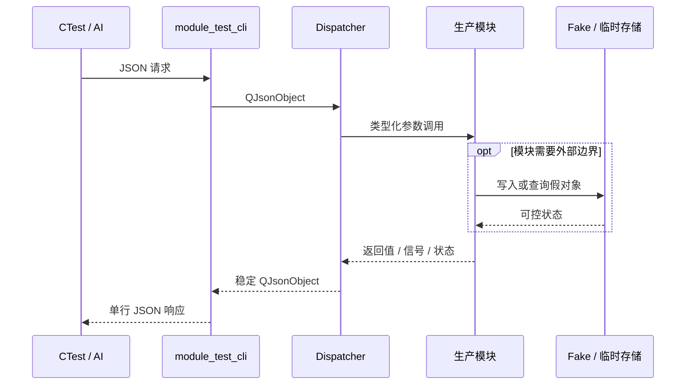

# 测试模块架构

## 目标

测试层为 AI 和自动化脚本提供一个稳定的模块调用边界：给 CLI 一行 JSON 标准输入，得到一行可结构化比较的 JSON 标准输出。测试直接链接桌面端生产源码，不复制实现代码；所有外部传输都替换为内存假对象。



## 分层

1. `module_test_cli.cpp`
   - 管理进程参数、JSONL 标准输入/输出和用例文件验证。
   - 每个非空输入行独立处理；单条失败不会破坏后续请求。
   - 将 `QSettings` 指向临时目录，进程退出后自动清理。

2. `ModuleTestDispatcher.cpp`
   - 校验 `module`、`action` 和 `input`。
   - 将 JSON 转换为真实 C++ 模块调用。
   - 过滤时间戳等不确定字段，输出稳定结果。
   - 内含最小 `FakeTransport`，只实现连接状态、名称和写入记录。

3. 生产模块
   - CMake 直接编译 `src` 下的真实 `.cpp`。
   - 测试中没有 `KeyboardProtocol`、`InputQueue` 等实现的复制件。

4. `cases/unit_cases.jsonl`
   - 一行一个 `{name, request, expect}` 契约。
   - `--verify` 使用 JSON 对象比较，不依赖字段排列顺序。
   - CTest 运行同一文件，保证人工调用与 CI 使用同一套预期。

## 当前覆盖边界

| 分类 | 模块 | 隔离方式 |
| --- | --- | --- |
| 纯逻辑 | `KeyboardProtocol`、`MouseProtocol` | 直接调用 |
| 纯逻辑 | `HudpProtocol` | 直接调用，不创建 socket |
| 状态 | `DebugTrace` | 直接调用 |
| 状态 | `SettingsManager` | 仅内存 setter/getter，不读写系统 |
| 配置 | `KeySettingManager` | 临时 `QSettings` 目录 |
| 控制器 | `TransportSelector` | `FakeTransport` |
| 控制器 | `InputQueue` | `FakeTransport` |
| 控制器 | `AutoClickerManager` | 有界事件循环与超时保护 |
| 控制器 | `MouseInputManager` | 显式 flush 验证 4 ms（250 Hz）聚合结果、分片与按钮顺序 |
| 控制器 | `LogManager` | 禁用日志文件，移除时间戳后比较 |

## 暂不测试的硬件与外部交互边界

以下模块本轮不接入 CLI，也不创建伪装成真实硬件的厚重 mock：

- 串口：`SerialTransport`、`SerialManager`。
- BLE/WinRT：`BleTransport`、`WinRtBleTransport`、`BleManager`、`BleSystemRouter`。
- 实际网络 I/O：`HudpTransport`。其纯封包算法 `HudpProtocol` 已覆盖。
- ESP32 固件运行时：`frame_processor`、`key_queue`、`text_assembler` 及 FreeRTOS/ESP-IDF 依赖。
- 操作系统或 UI 输入源：`CaptureManager` 的真实 Qt 键鼠事件过滤、`ClipboardTextSource`、`TextInputSource`。鼠标捕获后的纯状态处理由 `MouseInputManager` 单独覆盖。
- 聚合层：`InterfaceLayer` 及各 routes。它们依赖上述硬件、QML 或系统服务，后续应先做依赖注入再测试。

这些边界需要硬件在环测试、系统集成测试或专门的依赖注入接口，不应混入当前确定性单元测试进程。

## 确定性设计

- 不读取真实端口、设备列表、剪贴板、键盘或网络。
- 不在线下载测试框架；只依赖项目已经使用的 Qt Core。
- 二进制统一使用十六进制字符串表示。
- 日志结果不暴露时间戳。
- 自动点击仅允许 1 到 20 次有限运行，并设置超时。
- 鼠标聚合测试通过 `flush` 显式推进，不依赖墙钟等待；每个输出帧同时比较字段和十六进制编码。
- 设置数据写入进程专属临时目录。
- 契约失败输出实际值和预期值，便于 AI 定位差异。

## 运行链路



## 新增模块测试的步骤

1. 先判断模块是否能在不访问硬件和用户系统状态的前提下运行。
2. 在 `ModuleTestDispatcher.cpp` 新增 action，并做输入范围校验。
3. 响应只保留确定性、可序列化字段。
4. 在 `describe()` 登记 action。
5. 在 `cases/unit_cases.jsonl` 增加正常、边界和错误契约。
6. 更新 `AI_CLI_GUIDE.md` 的输入/输出说明。
7. 执行 `src/test/build_tests.bat`。

如果为了测试需要大量复制生产实现或模拟某个完整操作系统/硬件栈，应停止扩展这个 CLI，改用集成测试或先重构生产依赖边界。

## 目录职责

```text
src/test/
├── CMakeLists.txt               # 独立测试构建与 CTest 注册
├── build_tests.bat              # Windows 一键配置、构建、测试
├── module_test_cli.cpp          # CLI、JSONL、--verify
├── ModuleTestDispatcher.h/.cpp  # JSON 到生产模块的适配层
├── cases/
│   └── unit_cases.jsonl         # 固定输入/预期输出
└── docs/
    ├── AI_CLI_GUIDE.md          # AI 调用契约
    └── TEST_ARCHITECTURE.md     # 本文档
```
